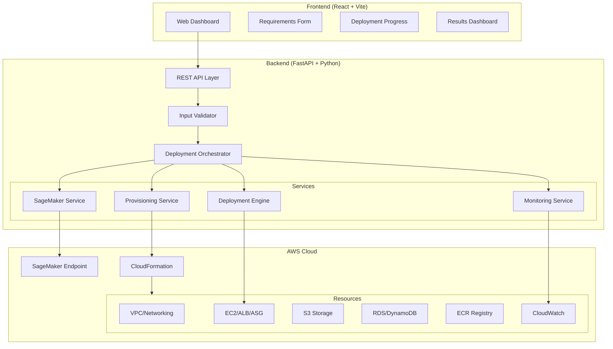
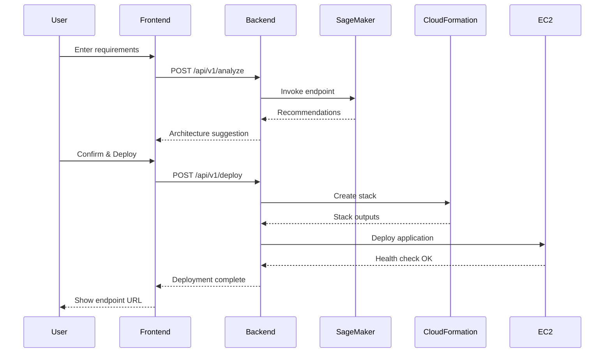

# AutoCloud Architect - Implementation Plan

An intelligent AWS infrastructure recommendation and automated deployment system that analyzes application requirements, uses Amazon SageMaker for recommendations, and automatically provisions AWS resources.

---

## System Architecture



---

## Technology Stack

| Layer | Technology | Justification |
|-------|------------|---------------|
| **Frontend** | React + Vite | Modern, fast build, component-based |
| **Styling** | Vanilla CSS + CSS Variables | Maximum flexibility, dark mode support |
| **Backend** | Python + FastAPI | Async support, excellent boto3 integration |
| **AWS SDK** | boto3 | Official AWS Python SDK |
| **IaC** | CloudFormation | Native AWS, no external dependencies |
| **ML** | SageMaker (Scikit-learn) | Lightweight, easy deployment |
| **Container** | Docker | Standard packaging format |

---

## Proposed Changes

### [NEW] Project Root Structure

```
AutoCloud Architect/
├── README.md
├── docker-compose.yml
├── .env.example
├── .gitignore
├── frontend/
├── backend/
├── sagemaker/
├── infrastructure/
└── docs/
```

---

### Component 1: Frontend

#### [NEW] [frontend/](file:///c:/Users/ktamn/OneDrive/Desktop/AutoCloud%20Architect/frontend)

React application with Vite bundler providing:

| File | Purpose |
|------|---------|
| `src/App.jsx` | Main application with routing |
| `src/components/RequirementsForm.jsx` | Multi-step form for app requirements |
| `src/components/DeploymentProgress.jsx` | Real-time deployment status |
| `src/components/ResultsDashboard.jsx` | Final deployment results |
| `src/components/ArchitectureDiagram.jsx` | Visual AWS architecture display |
| `src/services/api.js` | Backend API client |
| `src/hooks/useDeployment.js` | Deployment state management |
| `src/styles/index.css` | Design system with dark mode |

**Key Features:**
- Multi-step requirements wizard
- Real-time WebSocket updates for deployment progress
- Interactive architecture visualization
- Error handling with retry capabilities

---

### Component 2: Backend Core

#### [NEW] [backend/app/main.py](file:///c:/Users/ktamn/OneDrive/Desktop/AutoCloud%20Architect/backend/app/main.py)

FastAPI application entry point with CORS, middleware, and route registration.

#### [NEW] [backend/app/api/](file:///c:/Users/ktamn/OneDrive/Desktop/AutoCloud%20Architect/backend/app/api)

| Endpoint | Method | Purpose |
|----------|--------|---------|
| `/api/v1/analyze` | POST | Submit requirements, get recommendations |
| `/api/v1/deploy` | POST | Start deployment with recommendations |
| `/api/v1/deploy/{job_id}` | GET | Get deployment status |
| `/api/v1/deploy/{job_id}/logs` | GET | Stream deployment logs |
| `/api/v1/health` | GET | Service health check |

#### [NEW] [backend/app/schemas/](file:///c:/Users/ktamn/OneDrive/Desktop/AutoCloud%20Architect/backend/app/schemas)

Pydantic models for request/response validation:
- `RequirementsInput` - User application requirements
- `RecommendationOutput` - SageMaker recommendations
- `DeploymentStatus` - Deployment job state
- `AWSResource` - Provisioned resource details

---

### Component 3: AWS Services Integration

#### [NEW] [backend/app/services/sagemaker_service.py](file:///c:/Users/ktamn/OneDrive/Desktop/AutoCloud%20Architect/backend/app/services/sagemaker_service.py)

```python
# Communicates with SageMaker endpoint
async def get_recommendations(requirements: RequirementsInput) -> RecommendationOutput:
    # Transform input → invoke endpoint → parse response
```

#### [NEW] [backend/app/services/provisioning_service.py](file:///c:/Users/ktamn/OneDrive/Desktop/AutoCloud%20Architect/backend/app/services/provisioning_service.py)

```python
# Generates and deploys CloudFormation templates
async def provision_infrastructure(recommendations: RecommendationOutput) -> StackOutput:
    # Select template → customize parameters → create stack
```

#### [NEW] [backend/app/services/deployment_service.py](file:///c:/Users/ktamn/OneDrive/Desktop/AutoCloud%20Architect/backend/app/services/deployment_service.py)

```python
# Handles application deployment to provisioned resources
async def deploy_application(code_path: str, resources: StackOutput) -> DeploymentResult:
    # Package → upload → deploy → health check
```

---

### Component 4: SageMaker Model

#### [NEW] [sagemaker/dataset/training_data.csv](file:///c:/Users/ktamn/OneDrive/Desktop/AutoCloud%20Architect/sagemaker/dataset/training_data.csv)

Training dataset mapping requirements to AWS recommendations:

```csv
app_type,expected_users,data_size_gb,performance,budget,compute,storage,database,use_alb,use_asg
web,100,10,balanced,low,t3.micro,s3,dynamodb,0,0
web,10000,100,high,medium,m5.large,s3,rds-mysql,1,1
api,1000,50,balanced,medium,t3.medium,s3,dynamodb,1,0
...
```

#### [NEW] [sagemaker/training/train.py](file:///c:/Users/ktamn/OneDrive/Desktop/AutoCloud%20Architect/sagemaker/training/train.py)

Scikit-learn based multi-output classifier:
- Input: app requirements (encoded)
- Output: recommended compute, storage, database, networking options

#### [NEW] [sagemaker/inference/inference.py](file:///c:/Users/ktamn/OneDrive/Desktop/AutoCloud%20Architect/sagemaker/inference/inference.py)

SageMaker inference script with `model_fn`, `input_fn`, `predict_fn`, `output_fn`.

---

### Component 5: Infrastructure Templates

#### [NEW] [infrastructure/cloudformation/](file:///c:/Users/ktamn/OneDrive/Desktop/AutoCloud%20Architect/infrastructure/cloudformation)

| Template | Resources |
|----------|-----------|
| `vpc.yaml` | VPC, Subnets, IGW, NAT, Route Tables |
| `compute.yaml` | EC2, Launch Template, ASG, ALB |
| `storage.yaml` | S3 Bucket, RDS/DynamoDB |
| `iam.yaml` | Roles, Instance Profiles, Policies |
| `master.yaml` | Nested stack orchestrator |

Templates use parameters for dynamic customization based on recommendations.

---

## Data Flow



---

## IAM Security Design

| Role | Purpose | Key Permissions |
|------|---------|-----------------|
| `AutoCloudBackendRole` | Backend service | SageMaker:InvokeEndpoint, CloudFormation:*, EC2:*, S3:*, RDS:* |
| `AutoCloudEC2Role` | Deployed apps | S3:GetObject, CloudWatch:PutMetricData, Logs:* |
| `AutoCloudSageMakerRole` | ML model | S3:GetObject (model artifacts) |

> [!IMPORTANT]
> In production, these should follow least-privilege principles with resource-level restrictions.

---

## Verification Plan

### Automated Tests

1. **Backend Unit Tests**
   ```bash
   cd backend
   pip install -r requirements.txt
   pytest tests/ -v
   ```
   - Tests for input validation
   - Mock SageMaker responses
   - Template generation logic

2. **Frontend Component Tests**
   ```bash
   cd frontend
   npm install
   npm run test
   ```
   - Form validation tests
   - Component rendering tests

### Manual Verification

1. **Local Development Testing**
   ```bash
   # Terminal 1: Start backend
   cd backend
   uvicorn app.main:app --reload --port 8000
   
   # Terminal 2: Start frontend
   cd frontend
   npm run dev
   ```
   - Access http://localhost:5173
   - Fill requirements form
   - Verify API responses in Network tab

2. **AWS Integration Testing** (requires AWS credentials)
   - Configure `.env` with AWS credentials
   - Test SageMaker endpoint invocation
   - Test CloudFormation stack creation (use `--dry-run` first)

> [!NOTE]
> Full AWS testing requires valid AWS credentials and will incur costs. Local mock mode is available for development.

---

## Environment Setup

### Prerequisites
- Node.js 18+
- Python 3.10+
- AWS CLI configured
- Docker (optional)

### Quick Start
```bash
# Clone and setup
cd "AutoCloud Architect"

# Backend setup
cd backend
python -m venv venv
.\venv\Scripts\activate
pip install -r requirements.txt

# Frontend setup
cd ../frontend
npm install

# Configure environment
cp .env.example .env
# Edit .env with your AWS credentials
```

---

## File Structure Summary

```
AutoCloud Architect/
├── README.md                          # Project overview
├── docker-compose.yml                 # Container orchestration
├── .env.example                       # Environment template
├── .gitignore
│
├── frontend/
│   ├── package.json
│   ├── vite.config.js
│   ├── index.html
│   ├── public/
│   └── src/
│       ├── App.jsx
│       ├── main.jsx
│       ├── components/
│       │   ├── RequirementsForm.jsx
│       │   ├── DeploymentProgress.jsx
│       │   ├── ResultsDashboard.jsx
│       │   ├── ArchitectureDiagram.jsx
│       │   └── common/
│       ├── pages/
│       │   ├── HomePage.jsx
│       │   └── DeploymentPage.jsx
│       ├── services/
│       │   └── api.js
│       ├── hooks/
│       │   └── useDeployment.js
│       └── styles/
│           └── index.css
│
├── backend/
│   ├── requirements.txt
│   ├── Dockerfile
│   └── app/
│       ├── main.py
│       ├── config.py
│       ├── api/
│       │   ├── __init__.py
│       │   ├── routes.py
│       │   └── websocket.py
│       ├── core/
│       │   ├── __init__.py
│       │   └── exceptions.py
│       ├── schemas/
│       │   ├── __init__.py
│       │   ├── requirements.py
│       │   └── deployment.py
│       ├── services/
│       │   ├── __init__.py
│       │   ├── sagemaker_service.py
│       │   ├── provisioning_service.py
│       │   ├── deployment_service.py
│       │   └── monitoring_service.py
│       └── aws/
│           ├── __init__.py
│           ├── cloudformation.py
│           └── template_generator.py
│
├── sagemaker/
│   ├── dataset/
│   │   └── training_data.csv
│   ├── training/
│   │   ├── train.py
│   │   └── requirements.txt
│   ├── inference/
│   │   └── inference.py
│   └── deploy_endpoint.py
│
├── infrastructure/
│   └── cloudformation/
│       ├── master.yaml
│       ├── vpc.yaml
│       ├── compute.yaml
│       ├── storage.yaml
│       └── iam.yaml
│
└── docs/
    ├── architecture.md
    ├── setup.md
    └── api.md
```

---

## Next Steps After Approval

1. **Create project structure** - All folders and configuration files
2. **Build backend** - FastAPI app with all services
3. **Build frontend** - React dashboard with all components
4. **Create SageMaker artifacts** - Dataset, training, inference scripts
5. **Create CloudFormation templates** - All infrastructure definitions
6. **Write documentation** - Setup, API, architecture docs
7. **Add tests** - Unit and integration tests
